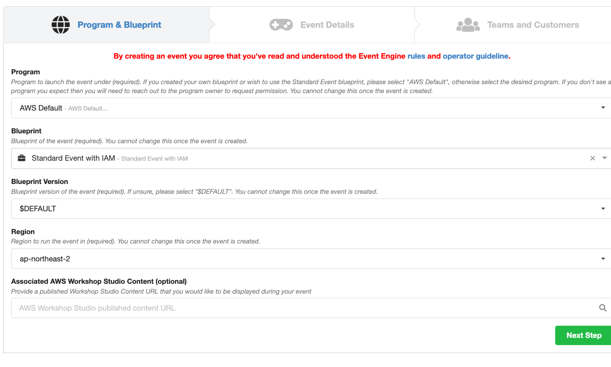
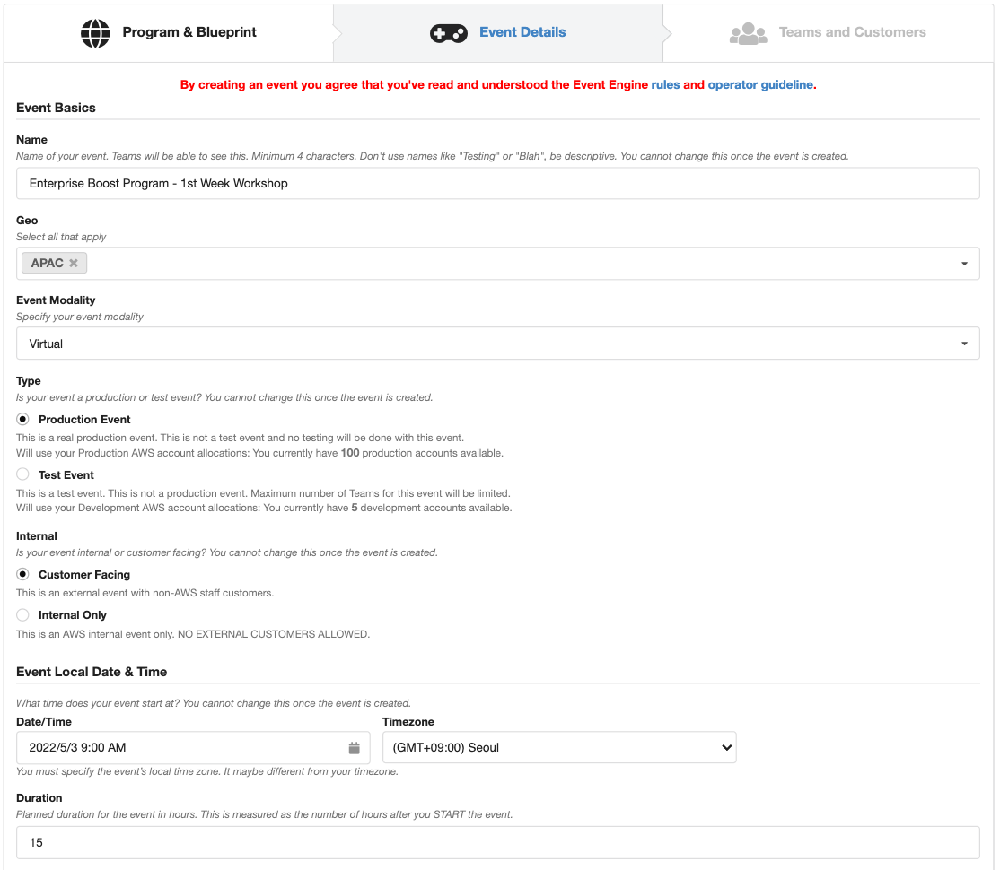
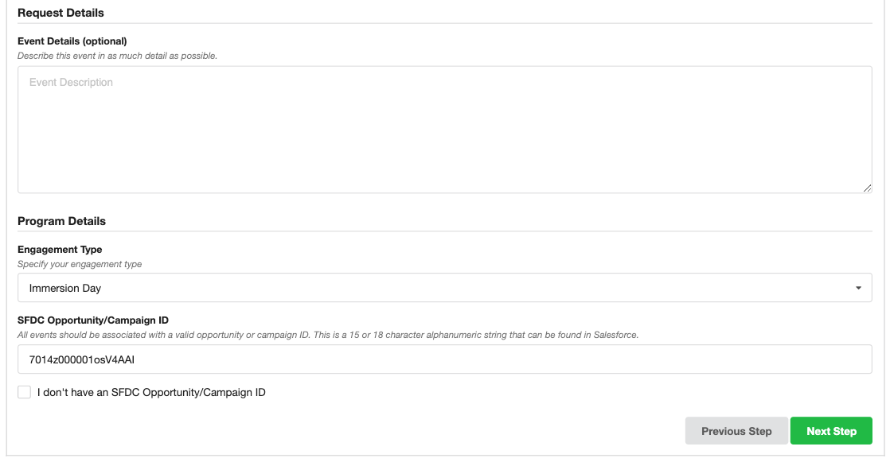
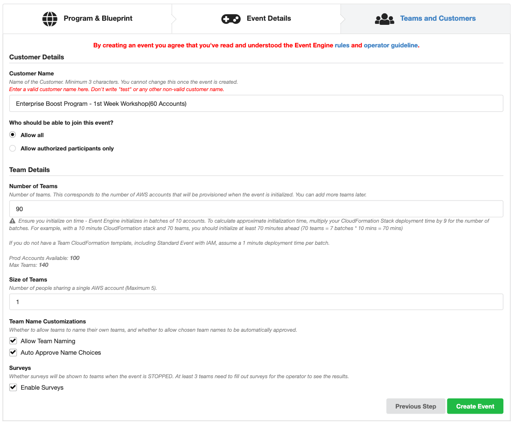

## Event Engine 생성 방법(대 고객용 Production Event)

---

1. [EventEngine Admin Page로 이동](https://admin.eventengine.run/dashboard/events) 

2. `Create Event` Click

3. `Program & Blue Print` Page에서 다음처럼 입력하고 `Next Step` Click

   ```
   Program : AWS Default
   Blueprint : Standard Event with IAM
   Blueparint Version : $DEFAULT
   Region : ap-northeast-2
   Associated AWS Workshop Studio Content (optional) : 입력 안함
   ```

   

4. `Event Details` Page에서 다음처럼 입력하고  `Next Step Click`

   ```
   Name : Enterprise Boost Program - 1st Week Workshop
   GEO : APAC
   Event Modality : Virtual
   Type : Production Event
   Internal : Custom Facing
   Event Local Date & Time 
     Date/Time: 2022/5/3 9:00 AM (AM/PM 확인)
     Timezone : GMT+9
   Duration : 15
   
   Engagement Type : Immersion Day
   SFDC Opportunity/Campaign ID : 7014z000001osV4AAI
    
   ```

   

   


5. `Teams and Customers` 에서 다음처럼 입력 후 `Create Event` Click

   ```
   Customer Details
   ---
   Customer Name : Enterprise Boost Program - 1st Week Workshop(60 Accounts)
   Who should be able to join this event? : Allow all
   
   Team Details
   ---
   Number of Teams : 90
   Size of Teams : 1 
   
   Team Name Customizations
   ---
   Allow Team Naming : 체크
   Auto Approve Name Choices : 체크
   
   Surveys
   ---
   Enable Surveys : 체크
   
   ```

   


